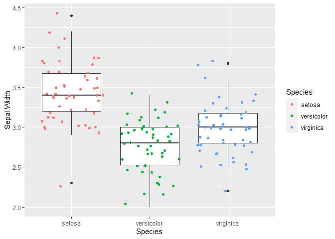
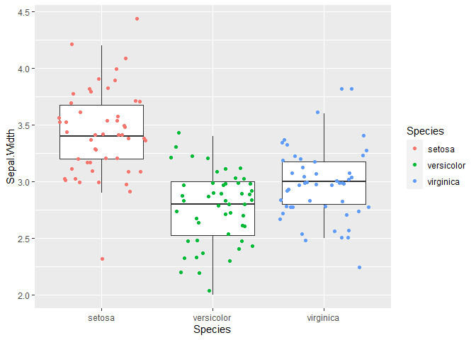

R Cheat Sheet
================
Kathrine McAulay

## Things I always forget

### Negating %in%

There isn’t a built-in way to do this; could assign `Negate('%in%')` to
anything, but `%!in%` seems logical

``` r
`%!in%` = Negate(`%in%`)
```

Source: [Stack
Overflow](https://stackoverflow.com/questions/38351820/negation-of-in-in-r),
additional similar solutions here and in linked post.

### Excluding geom_boxplot outliers

If overlaying `geom_jitter` and `geom_boxplot`, points representing
outliers will be plotted with both geoms; exclude these from
`geom_boxplot` using `outlier.shape = NA`, for example:

``` r
library(ggplot2)
iris |>
  ggplot(aes(x = Species, y = Sepal.Width)) +
  geom_boxplot() +
  geom_jitter(aes(color = Species))
```



``` r
iris |>
  ggplot(aes(x = Species, y = Sepal.Width)) +
  geom_boxplot(outlier.shape = NA) +
  geom_jitter(aes(color = Species))
```



### Pivoting data

Pass additional arguements in `values_fun` when using `pivot_wider`with
the following format: `values_fn = function(x){mean(x,na.rm = T)}`

``` r
library(dplyr)
```


    Attaching package: 'dplyr'

    The following objects are masked from 'package:stats':

        filter, lag

    The following objects are masked from 'package:base':

        intersect, setdiff, setequal, union

``` r
library(tidyr)
iris |>
  select(Sepal.Length, Species) |>
  pivot_wider(names_from = Species,
              values_from = Sepal.Length,
              values_fn = function(x){mean(x,na.rm = T)})
```

    # A tibble: 1 × 3
      setosa versicolor virginica
       <dbl>      <dbl>     <dbl>
    1   5.01       5.94      6.59

Source: [pivot_wider
documentation](http://127.0.0.1:63596/help/library/tidyr/html/pivot_wider.html)
and [this GitHub issue](https://github.com/tidyverse/tidyr/issues/1114)
